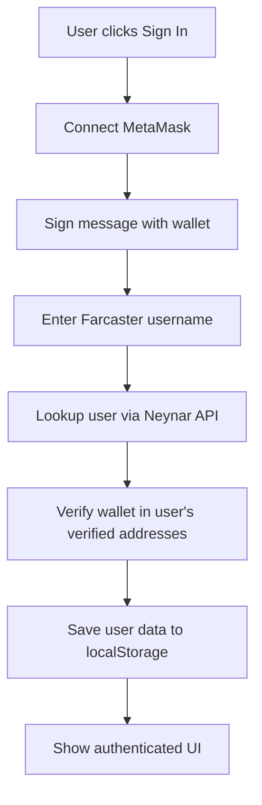
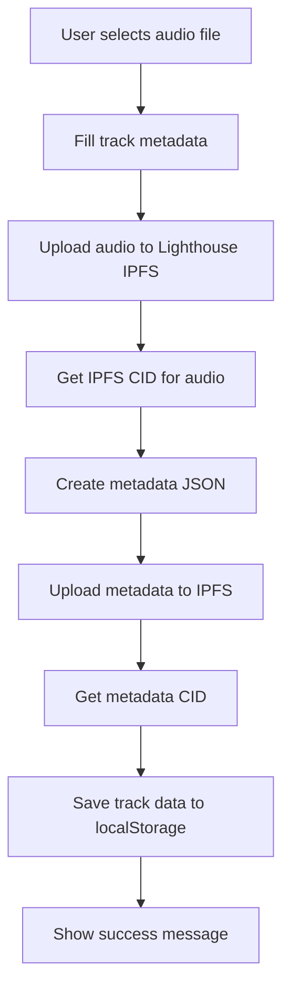
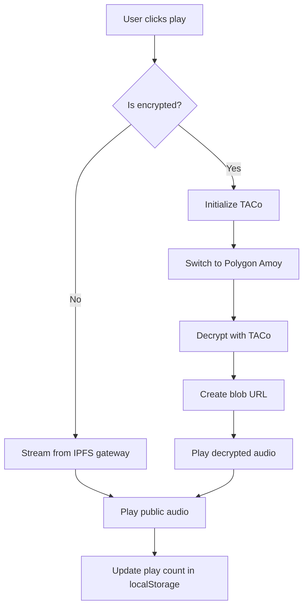

# SoundProof MVP Architecture Documentation 🏗️

Complete system architecture, components, and data flow documentation for easy understanding and maintenance.

## 🎯 System Overview

SoundProof is a **Farcaster-native music discovery platform** with **local-first storage** and **IPFS permanence**.

### Core Principles
- **Farcaster Native**: Authentication and social features via Farcaster protocol
- **Local First**: User data in localStorage, no database dependency
- **IPFS Permanent**: Audio files and metadata stored permanently on IPFS
- **Decentralized**: No backend server, all operations client-side

## 🏛️ Architecture Layers

```
┌─────────────────────────────────────────────────┐
│                 Frontend (React)                │
├─────────────────────────────────────────────────┤
│              Local Storage Layer                │
├─────────────────────────────────────────────────┤
│         External APIs (Farcaster, IPFS)        │
├─────────────────────────────────────────────────┤
│            Blockchain (TACo/Polygon)           │
└─────────────────────────────────────────────────┘
```

### Layer Details

1. **Frontend**: React + TypeScript + Tailwind CSS + shadcn/ui
2. **Local Storage**: Browser localStorage for user profiles and track metadata
3. **External APIs**: Neynar (Farcaster) + Lighthouse (IPFS)
4. **Blockchain**: Ethereum (auth) + Polygon Amoy (TACo encryption)

## 📁 Project Structure

```
src/
├── components/                 # React components
│   ├── FarcasterConnection.tsx    # Sign in with Farcaster
│   ├── MusicFeedSimple.tsx       # Track discovery feed  
│   ├── UploadTrackSimple.tsx     # Track upload interface
│   ├── UserProfileSimple.tsx     # User profile and tracks
│   ├── NavigationSimple.tsx      # App navigation
│   ├── PlayerBar.tsx             # Audio player
│   └── FarcasterTest.tsx         # API testing component
│
├── hooks/                      # React hooks
│   ├── useFarcasterAuth.ts       # Farcaster authentication
│   └── useAudioPlayer.ts         # Audio playback logic
│
├── contexts/                   # React contexts
│   └── PlaybackContext.tsx      # Global audio playback state
│
├── services/                   # External service integrations
│   ├── lighthouseService.ts      # IPFS file operations
│   └── ipfsMetadata.ts          # Metadata storage on IPFS
│
├── integrations/farcaster/     # Farcaster SDK integration
│   ├── client.ts                # Neynar API client
│   ├── types.ts                 # TypeScript definitions
│   ├── utils.ts                 # Helper functions
│   └── index.ts                 # Public exports
│
├── utils/                      # Utility functions
│   ├── localStorage.ts           # Local storage management
│   └── encryption.ts            # TACo encryption helpers
│
└── types/                      # TypeScript type definitions
    └── access-rules.ts          # Access control types
```

## 🔄 Data Flow Architecture

### 1. User Authentication Flow



**Components Involved:**
- `FarcasterConnection.tsx` - UI component
- `useFarcasterAuth.ts` - Authentication logic
- `client.ts` - Farcaster API calls
- `localStorage.ts` - Data persistence

### 2. Track Upload Flow



**Components Involved:**
- `UploadTrackSimple.tsx` - UI component
- `lighthouseService.ts` - IPFS uploads
- `ipfsMetadata.ts` - Metadata management
- `localStorage.ts` - Track storage

### 3. Audio Playback Flow



**Components Involved:**
- `MusicFeedSimple.tsx` / `UserProfileSimple.tsx` - Play buttons
- `PlaybackContext.tsx` - Playback state management
- `useAudioPlayer.ts` - Audio controls
- `PlayerBar.tsx` - Player UI
- `utils/encryption.ts` - TACo decryption

## 🧩 Component Architecture

### Authentication System

```typescript
// useFarcasterAuth.ts - Main auth hook
interface FarcasterAuthState {
  isConnected: boolean;
  user: FarcasterUser | null;
  verifiedAddress: string | null;
  signer: ethers.providers.JsonRpcSigner | null;
  isLoading: boolean;
}

// FarcasterConnection.tsx - Sign in UI
// NavigationSimple.tsx - Shows auth state
// All components - Use auth context
```

### Storage System

```typescript
// localStorage.ts - Storage utilities
export interface StoredUser extends FarcasterUser {
  walletAddress?: string;
  lastLogin: string;
}

export interface StoredTrack {
  id: string;
  title: string;
  artist: string;
  uploader: string; // FID
  cid: string; // IPFS hash
  accessRule: AccessRule;
  isEncrypted: boolean;
  uploadedAt: string;
  playCount: number;
}
```

### Farcaster Integration

```typescript
// client.ts - Neynar SDK wrapper
class FarcasterClient {
  private client: NeynarAPIClient;
  
  async getUserByUsername(username: string): Promise<FarcasterUser | null>
  async getUserByFid(fid: number): Promise<FarcasterUser | null>
  async publishCast(text: string): Promise<FarcasterCast>
}

// types.ts - Farcaster type definitions
export interface FarcasterUser {
  fid: number;
  username: string;
  displayName: string;
  pfp: { url: string };
  verifications: string[]; // Verified addresses
}
```

## 🔐 Security Architecture

### Authentication Security
- **Message Signing**: Wallet signs authentication message
- **Address Verification**: Wallet must be verified on Farcaster profile  
- **No Private Keys**: Keys never stored, only signer reference
- **Session Persistence**: User data in localStorage, not sensitive keys

### Access Control
- **Public Tracks**: Direct IPFS access, no restrictions
- **Encrypted Tracks**: TACo threshold encryption with conditions
- **Wallet Verification**: Must own verified address to decrypt

### Data Protection
- **Local Storage**: User profiles and preferences only
- **IPFS**: Immutable, permanent storage for files and metadata
- **No Backend**: No server to compromise, all client-side

## 🌐 External Dependencies

### APIs and Services

| Service | Purpose | Environment Variable | Fallback |
|---------|---------|---------------------|----------|
| Neynar | Farcaster API access | `VITE_NEYNAR_API_KEY` | None (required) |
| Lighthouse | IPFS file storage | `VITE_LIGHTHOUSE_API_KEY` | None (required) |
| MetaMask | Wallet connection | None | Browser extension |
| Polygon Amoy | TACo blockchain | None | RPC endpoint |

### Network Dependencies

```typescript
// Farcaster Protocol
- Neynar API: https://api.neynar.com/v2/
- Rate limits: 100 requests/minute (default)

// IPFS Storage  
- Lighthouse API: https://node.lighthouse.storage/api/v0/
- Gateway: https://gateway.lighthouse.storage/ipfs/
- File limits: 1GB per file

// Blockchain
- Ethereum: wallet.ethereum (MetaMask)
- Polygon Amoy: https://rpc-amoy.polygon.technology
- Chain ID: 80002 (Amoy testnet)
```

## 📊 State Management

### Global State (Context)

```typescript
// PlaybackContext.tsx - Audio playback state
interface PlaybackContextType {
  currentTrack: Track | null;
  isPlaying: boolean;
  currentTime: number;
  duration: number;
  volume: number;
  isLoading: boolean;
}

// Available throughout app via usePlayback() hook
```

### Local State (localStorage)

```typescript
// Managed by localStorage.ts utilities
- User profile: 'soundproof_user'
- User tracks: 'soundproof_user_tracks'  
- Feed tracks: 'soundproof_feed_tracks'
- App settings: 'soundproof_settings'
```

### Component State

```typescript
// Each component manages its own UI state
- Loading states
- Form inputs  
- Error messages
- Modal visibility
```

## 🚀 Performance Considerations

### Optimization Strategies

1. **Lazy Loading**: Components loaded on demand
2. **Caching**: localStorage caches user data and tracks
3. **IPFS Gateway**: Multiple gateway fallbacks for reliability
4. **Pagination**: Feed tracks limited to 100 most recent
5. **Debouncing**: Search queries debounced to reduce API calls

### Resource Management

```typescript
// Audio files
- Stream directly from IPFS (no local storage)
- Create blob URLs only for decrypted content
- Clean up blob URLs after use

// API calls
- Rate limiting built into Farcaster client
- Error handling with exponential backoff
- Health checks before critical operations

// localStorage
- Automatic cleanup of old data
- Export/import for user data portability
- Size monitoring to prevent quota exceeded
```

## 🔧 Configuration

### Environment Variables

```bash
# Required for core functionality
VITE_NEYNAR_API_KEY=your_neynar_api_key
VITE_LIGHTHOUSE_API_KEY=your_lighthouse_api_key

# Optional for development
NODE_ENV=development
VITE_APP_URL=http://localhost:8080
```

### Build Configuration

```typescript
// vite.config.ts
export default defineConfig({
  plugins: [react()],
  resolve: {
    alias: {
      "@": path.resolve(__dirname, "./src"),
    },
  },
  define: {
    global: 'globalThis', // For ethers.js compatibility
  },
})
```

## 🔍 Debugging Architecture

### Logging Strategy

```typescript
// Console logging levels
- Info: User actions, successful operations
- Warn: Recoverable errors, fallback usage
- Error: Failed operations, API errors
- Debug: Detailed flow information (dev only)

// Key debug points
- Authentication flow steps
- IPFS upload progress  
- TACo encryption/decryption
- localStorage operations
```

### Error Handling

```typescript
// Component level
- Try/catch blocks around async operations
- User-friendly error messages via toast
- Fallback UI states for errors

// Service level  
- API client error transformation
- Retry logic with exponential backoff
- Circuit breaker patterns for external services
```

## 📈 Scalability Considerations

### Current Limitations

1. **localStorage Size**: ~10MB limit per domain
2. **No Search Backend**: Search limited to loaded tracks
3. **No Caching Layer**: Every API call hits external services
4. **No CDN**: IPFS gateway performance varies by region

### Future Scaling Path

1. **Add Backend**: Database for search, analytics, caching
2. **Implement CDN**: Cache IPFS content globally
3. **Add Search Service**: Elasticsearch for track discovery
4. **Optimize Storage**: Move to IndexedDB for larger datasets
5. **Add Monitoring**: Error tracking, performance metrics

## 🎉 Summary

This architecture provides:

- ✅ **Zero Backend**: Pure client-side application
- ✅ **Farcaster Native**: Full social integration
- ✅ **Decentralized Storage**: IPFS for permanence
- ✅ **Local First**: Fast, offline-capable experience  
- ✅ **Modular Design**: Easy to understand and extend
- ✅ **Production Ready**: Can scale with additional infrastructure

Perfect for an MVP that can grow into a full platform! 🎵